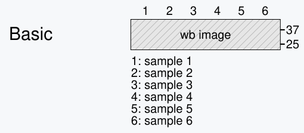
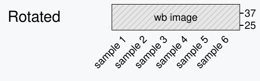
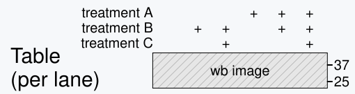
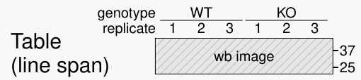

# MyWB App

MyWB is an end-to-end desktop app for processing and analyzing western blot images (and other gel images, too).

### Do any of these challenges sound familiar?

Leave the back-and-forth behind. MyWB unites everything from source images to analysis and presentation in one seamless workflow, where you can align, rotate, tune intensity, crop, label, quantify, and export. It also lays the groundwork for easier figure traceability in PowerPoint.

<strong>Download the latest version</strong>

  
  
  

  <a href="https://github.com/MasaakiU/MyWB-releases/releases">Release notes and previous versions</a>
  &nbsp;&nbsp;·&nbsp;&nbsp;
  <a href="docs/installation.md#system-requirements">System requirements</a>

## Contents

- [Features](#features)
- [System requirements](docs/installation.md#system-requirements)
- [Installation](docs/installation.md)
- [User Guide](docs/user-guide.md)
- [Troubleshooting](docs/troubleshooting.md)
- [Legal and Privacy](#legal-and-privacy)

## Features

### Four Controls, One Workflow

From image preparation to analysis and presentation, every step stays within easy reach.

<table>
  <thead>
    <tr>
      <th align="left">Button</th>
      <th align="left">What it does</th>
    </tr>
  </thead>
  <tbody>
    <tr>
      <td valign="middle" nowrap="nowrap">
        <a href="docs/user-guide.md#from-blot-to-figure" aria-label="Marker/blot view"><picture><source media="(prefers-color-scheme: dark)" srcset="docs/assets/table-columns-solid_gray20.svg"></picture></a>&nbsp;<a href="docs/user-guide.md#from-blot-to-figure"><strong>Marker/blot&nbsp;view</strong></a>
      </td>
      <td valign="middle">Adjust marker and blot images, select an ROI, and add labels.</td>
    </tr>
    <tr>
      <td valign="middle" nowrap="nowrap">
        <a href="docs/user-guide.md#from-blot-to-figure" aria-label="SVG preview"><picture><source media="(prefers-color-scheme: dark)" srcset="docs/assets/eye-solid_gray20.svg"></picture></a>&nbsp;<a href="docs/user-guide.md#from-blot-to-figure"><strong>SVG&nbsp;preview</strong></a>
      </td>
      <td valign="middle">Review the SVG output and edit its styles before saving.</td>
    </tr>
    <tr>
      <td valign="middle" nowrap="nowrap">
        <a href="docs/user-guide.md#quantification-access" aria-label="Quantification"><picture><source media="(prefers-color-scheme: dark)" srcset="docs/assets/square-minus-regular_WB_gray20.svg"></picture></a>&nbsp;<a href="docs/user-guide.md#quantification-access"><strong>Quantification</strong></a>
      </td>
      <td valign="middle">Analyze lanes in the selected ROI (Premium feature).</td>
    </tr>
    <tr>
      <td valign="middle" nowrap="nowrap">
        <a href="docs/user-guide.md#powerpoint-workflow" aria-label="Copy SVG for PowerPoint"><picture><source media="(prefers-color-scheme: dark)" srcset="docs/assets/copy_to_powerpoint_gray20.svg"></picture></a>&nbsp;<a href="docs/user-guide.md#powerpoint-workflow"><strong>Copy&nbsp;for&nbsp;PowerPoint</strong></a>&nbsp;&nbsp;
      </td>
      <td valign="middle">More than a simple image copy—preserve MyWB metadata for future traceability.</td>
    </tr>
  </tbody>
</table>

### Flexible output layouts

Choose from a variety of sample-label layouts—with more to come!

## Legal and Privacy

- See [`LICENSE`](LICENSE) for the MyWB license.
- See the [MyWB Privacy Policy](docs/legal/privacy-policy.md).
- See the [macOS third-party software notices](docs/legal/THIRD_PARTY_NOTICES.txt).
- For macOS, see the Qt/PySide6 [corresponding-source offer](docs/legal/third_party/qt/SOURCE-CODE-OFFER.txt)
  and [replacement and re-signing instructions](docs/legal/third_party/qt/RELINKING-INSTRUCTIONS.txt)
  for exercising the rights provided by their LGPL terms.
- Windows-specific notices and legal materials are included with the Windows application and are available through **Help > About > Legal Information**.
