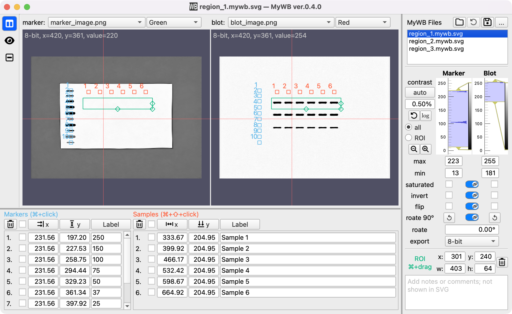
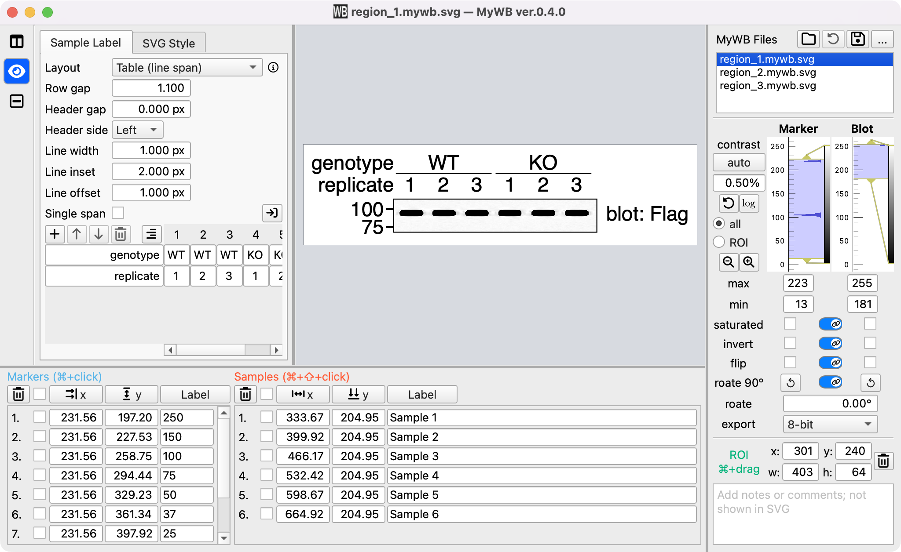
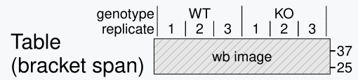

# MyWB Standalone App

MyWB is a desktop app for western blot image alignment, labeling, SVG export, and quantification.

Download the latest version of MyWB from the [GitHub Releases page](https://github.com/MasaakiU/MyWB-releases/releases).

## Contents

- [Features](#features)
- [How to Install](#how-to-install)
- [Quantification Access](#quantification-access)
- [Troubleshooting](#troubleshooting)
- [License](#license)

## Features

### Do any of these challenges sound familiar?

- Is marking molecular-weight positions on your blot image using a separate marker image tedious?
- Does creating and arranging sample labels take too much time?
- Is straightening a tilted image more work than it should be?
- Do mismatched marker and blot image sizes force you to resize them manually?
- Do you want finer control over blot brightness and contrast?
- Is organizing multiple membranes captured in a single image becoming a chore?

MyWB solves these problems by bringing image alignment, rotation, intensity adjustment, labeling, cropping, and export into one streamlined workflow!

### From source images to a finished figure

1. Start with your marker and blot images.

2. Select the region of interest (ROI).

3. Add molecular-weight values and sample labels.

   

4. Select the SVG Preview button (the eye icon in the left-hand toolbar) to review your figure.

   **Your polished figure is now ready for presentation!**

   

Save your work as a MyWB SVG file (`.mywb.svg`), which can be reopened in MyWB, inserted into PowerPoint, or edited in tools such as Inkscape.

### Flexible output layouts

Choose from a variety of sample-label layouts—with more to come!

## How to Install

### macOS

Download the one that matches your Mac. To check which type of Mac you have, open the Apple menu and select `About This Mac`.

- **Apple silicon (`arm64`)** — for Macs with an Apple M-series chip. Choose the file ending in `-macos-arm64.dmg`.
- **Intel (`x86_64`)** — for Macs with an Intel processor. Choose the file ending in `-macos-x86_64.dmg`.

Once you have downloaded the appropriate version:

1. Open the downloaded `.dmg` file.
2. Drag `MyWB.app` into the `Applications` folder.
3. Open `MyWB.app` from the `Applications` folder.

If macOS blocks the app the first time you open it:

1. Right-click `MyWB.app`.
2. Choose `Open`.
3. Confirm that you want to open the app.

If the app is still blocked:

1. Open `System Settings`.
2. Go to `Privacy & Security`.
3. Scroll down to the `Security` section.
4. Look for a message saying that `MyWB.app` was blocked.
5. Click `Open Anyway`.
6. Enter your Mac password or use Touch ID if asked.
7. Try opening `MyWB.app` again.

## Quantification Access

After selecting an ROI, select the Quantification button (the third button in the left-hand toolbar) to open Quantification.

Quantification is a Premium feature. Premium Access for Quantification is currently provided at no charge for personal, academic, and internal research uses permitted by the MyWB License. An internet connection is required the first time you use Quantification and at least once every 30 days afterward to verify continued availability. After a successful check, Quantification can be used offline for up to 30 days.

If verification cannot be completed after the cached authorization expires, Quantification becomes temporarily unavailable. All other features and your local files remain available.

## Troubleshooting

### The app does not open

On macOS, right-click `MyWB.app` and choose `Open`. If the app is still blocked, check `System Settings` > `Privacy & Security`.

### The app cannot access files

Make sure MyWB has permission to access the folder containing your images or output files. On macOS, folder access can be managed in `System Settings` > `Privacy & Security`.

## License

- See [`LICENSE.txt`](LICENSE.txt) for the MyWB license.
- See [`THIRD_PARTY_NOTICES.txt`](THIRD_PARTY_NOTICES.txt) for third-party software notices.
