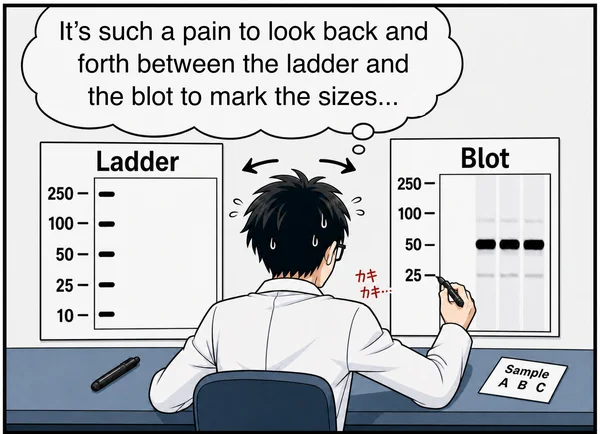

# MyWB App

MyWB is a desktop app for western blot image alignment, labeling, SVG export, and quantification.

  
  &nbsp;
  

<a href="https://github.com/MasaakiU/MyWB-releases/releases">Previous versions</a>

## Contents

- [Features](#features)
- [How to Install](#how-to-install)
- [From Blot to Figure](#from-blot-to-figure)
- [Quantification Access](#quantification-access)
- [PowerPoint Workflow](#powerpoint-workflow)
- [Troubleshooting](#troubleshooting)
- [Legal and Privacy](#legal-and-privacy)

## Features

### Do any of these challenges sound familiar?

MyWB streamlines western blot figure preparation by bringing image alignment, rotation, intensity adjustment, labeling, cropping, and export into one workflow—and is laying the groundwork for easier figure traceability in PowerPoint.

### Four Controls, One Workflow

From image preparation to analysis and presentation, every step stays within easy reach.

<table>
  <thead>
    <tr>
      <th align="left">Button</th>
      <th align="left">What it does</th>
    </tr>
  </thead>
  <tbody>
    <tr>
      <td valign="middle" nowrap="nowrap">
        <a href="#from-blot-to-figure" aria-label="Marker/blot view"><picture><source media="(prefers-color-scheme: dark)" srcset=".github/assets/table-columns-solid_gray20.svg"></picture></a>&nbsp;<a href="#from-blot-to-figure"><strong>Marker/blot&nbsp;view</strong></a>
      </td>
      <td valign="middle">Adjust marker and blot images, select an ROI, and add labels.</td>
    </tr>
    <tr>
      <td valign="middle" nowrap="nowrap">
        <a href="#from-blot-to-figure" aria-label="SVG preview"><picture><source media="(prefers-color-scheme: dark)" srcset=".github/assets/eye-solid_gray20.svg"></picture></a>&nbsp;<a href="#from-blot-to-figure"><strong>SVG&nbsp;preview</strong></a>
      </td>
      <td valign="middle">Review the SVG output and edit its styles before saving.</td>
    </tr>
    <tr>
      <td valign="middle" nowrap="nowrap">
        <a href="#quantification-access" aria-label="Quantification"><picture><source media="(prefers-color-scheme: dark)" srcset=".github/assets/square-minus-regular_WB_gray20.svg"></picture></a>&nbsp;<a href="#quantification-access"><strong>Quantification</strong></a>
      </td>
      <td valign="middle">Analyze lanes in the selected ROI (Premium feature).</td>
    </tr>
    <tr>
      <td valign="middle" nowrap="nowrap">
        <a href="#powerpoint-workflow" aria-label="Copy SVG for PowerPoint"><picture><source media="(prefers-color-scheme: dark)" srcset=".github/assets/copy_to_powerpoint_gray20.svg"></picture></a>&nbsp;<a href="#powerpoint-workflow"><strong>Copy&nbsp;SVG&nbsp;for&nbsp;PowerPoint</strong></a>
      </td>
      <td valign="middle">More than a simple image copy—preserve MyWB metadata for future traceability.</td>
    </tr>
  </tbody>
</table>

### Flexible output layouts

Choose from a variety of sample-label layouts—with more to come!

## How to Install

### macOS

Download the version that matches your Mac. To check which type of Mac you have, open the Apple menu and select `About This Mac`.

- **[Download for Apple silicon (`arm64`)](https://download.mybioapps.com/mywb/download/latest/macos/arm64)** — for Macs with an Apple M-series chip. The downloaded file ends in `-macos-arm64.dmg`.
- **[Download for Intel (`x86_64`)](https://download.mybioapps.com/mywb/download/latest/macos/x86_64)** — for Macs with an Intel processor. The downloaded file ends in `-macos-x86_64.dmg`.

For release notes, checksums, or previous versions, see the [GitHub Releases page](https://github.com/MasaakiU/MyWB-releases/releases).

Once you have downloaded the appropriate version:

1. Open the downloaded `.dmg` file.
2. Drag `MyWB.app` into the `Applications` folder.

#### First launch

The current MyWB release is not signed with a Developer ID certificate and has not been notarized by Apple, so macOS will normally block it on first launch. To allow MyWB to run:

1. Double-click `MyWB.app` in the `Applications` folder once, then dismiss the warning that says the developer cannot be verified or Apple cannot check the app for malicious software.
2. Open `System Settings` and go to `Privacy & Security`.
3. Scroll down to the `Security` section and click `Open Anyway` next to the message about `MyWB.app`.
4. Enter your Mac password or use Touch ID if asked.
5. When the warning appears again, click `Open`.

`Open Anyway` is available for about one hour after the first launch attempt. Only override the warning if you downloaded MyWB using the official links above. Do not override an alert saying that the app will damage your computer or is damaged; download the DMG again and report the problem if it continues.

For more information, see [Apple's instructions for opening an app from an unidentified developer](https://support.apple.com/102445).

## From Blot to Figure

1. Open your marker and blot images in the **Marker/blot view**.

2. Select the region of interest (ROI).

3. Add molecular-weight values and sample labels.

   

4. Select the **SVG Preview button** (the eye icon in the left-hand toolbar) to review your figure.

   **Your polished figure is now ready for presentation!**

   

Save your work as a MyWB SVG file (`.mywb.svg`), which can be reopened in MyWB or edited in tools such as Inkscape.

## Quantification Access

After selecting an ROI, select the **Quantification button** (the third button in the left-hand toolbar) to open Quantification.

Quantification is a Premium feature. Premium Access for Quantification is currently provided at no charge for personal, academic, and internal research uses permitted by the MyWB License. An internet connection is required the first time you use Quantification and at least once every 30 days afterward to verify continued availability. After a successful check, Quantification can be used offline for up to 30 days.

If verification cannot be completed after the cached authorization expires, Quantification becomes temporarily unavailable. All other features and your local files remain available.

## PowerPoint Workflow

To paste a MyWB SVG figure into PowerPoint, click the **Copy SVG for PowerPoint** button (at the bottom of the left-hand toolbar), then paste it directly onto your slide.

With one click, the SVG is copied so that its embedded MyWB metadata remains intact when pasted into PowerPoint. A future major update to MyWB is planned to read this information from PowerPoint files, making it easier to identify each MyWB SVG in a presentation and trace it back to its original source images. We recommend copying MyWB SVG figures directly from MyWB now so they are prepared for that future capability.

This feature uses the system clipboard rather than an official Microsoft API. Because Microsoft controls how PowerPoint handles SVG clipboard data, compatibility with all future versions of PowerPoint cannot be guaranteed.

> [!CAUTION]
> **Always copy from MyWB.** Embedded MyWB metadata is not preserved when you insert an exported SVG using PowerPoint's **Insert > Pictures** command or drag it in from Finder (macOS) or File Explorer (Windows).

## Troubleshooting

### The app does not open

On macOS, follow the [first-launch instructions](#first-launch). If `Open Anyway` is not visible, try to open `MyWB.app` once more; the button only appears for about one hour after a blocked launch attempt. On a Mac managed by an organization, contact your administrator if the setting is unavailable.

### The app cannot access files

Make sure MyWB has permission to access the folder containing your images or output files. On macOS, folder access can be managed in `System Settings` > `Privacy & Security`.

## Legal and Privacy

- See [`LICENSE.txt`](LICENSE.txt) for the MyWB license.
- See [`privacy-policy.md`](privacy-policy.md) for the MyWB Privacy Policy.
- See [`THIRD_PARTY_NOTICES.txt`](THIRD_PARTY_NOTICES.txt) for third-party software notices.
- See the Qt/PySide6 [`corresponding-source offer`](third_party/qt/SOURCE-CODE-OFFER.txt)
  and [`replacement and re-signing instructions`](third_party/qt/RELINKING-INSTRUCTIONS.txt)
  for exercising the rights provided by their LGPL terms.
