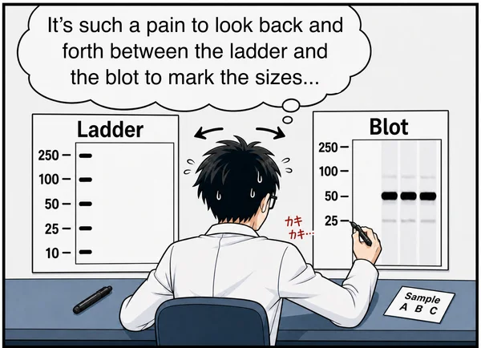
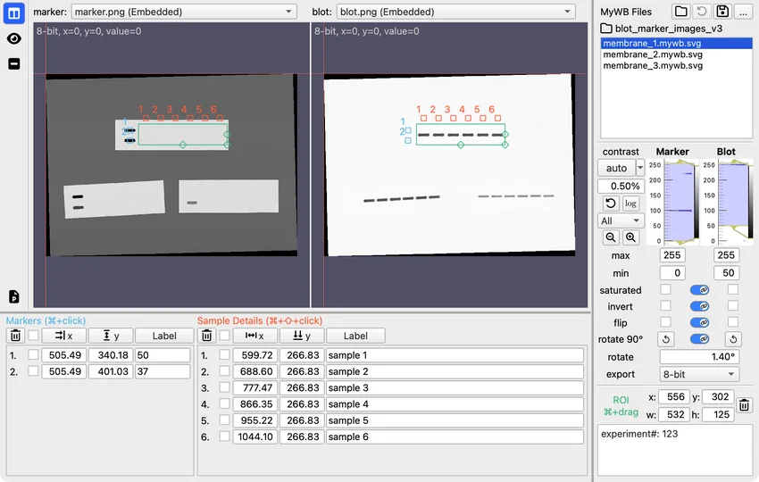

# MyWB App

MyWB is an end-to-end desktop app for processing and analyzing western blot images (and other gel images, too).

### Do any of these challenges sound familiar?

Leave the back-and-forth behind. MyWB unites everything from source images to analysis and presentation in one seamless workflow, where you can align, rotate, tune intensity, crop, label, quantify, and export. It also lays the groundwork for easier figure traceability in PowerPoint.

<strong>Download the latest version</strong>

  
  
  

  <a href="https://github.com/MasaakiU/MyWB-releases/releases">Release notes and previous versions</a>
  &nbsp;&nbsp;·&nbsp;&nbsp;
  <a href="docs/installation.md#system-requirements">System requirements</a>

## Documentation

- [Introduction](docs/introduction.md)
- [Installation](docs/installation.md)
- [How to use MyWB](docs/user-guide.md)
- [Troubleshooting](docs/troubleshooting.md)
- [Legal and Privacy](docs/legal-and-privacy.md)

## Features

### Bidirectional Workflow

From raw data to presentations, and trace it back to the source.

### Four Controls, One Interface

<table>
  <thead>
    <tr>
      <th align="left">Button</th>
      <th align="left">What it does</th>
    </tr>
  </thead>
  <tbody>
    <tr>
      <td valign="middle" nowrap="nowrap">
        <a href="docs/user-guide/from-blot-to-figure.md" aria-label="Marker/blot view"><picture><source media="(prefers-color-scheme: dark)" srcset="docs/assets/table-columns-solid_gray20.svg"></picture></a>&nbsp;<a href="docs/user-guide/from-blot-to-figure.md"><strong>Marker/blot&nbsp;view</strong></a>
      </td>
      <td valign="middle">Adjust marker and blot images, select an ROI, and add labels.</td>
    </tr>
    <tr>
      <td valign="middle" nowrap="nowrap">
        <a href="docs/user-guide/design-and-preview-figure.md" aria-label="SVG preview"><picture><source media="(prefers-color-scheme: dark)" srcset="docs/assets/eye-solid_gray20.svg"></picture></a>&nbsp;<a href="docs/user-guide/design-and-preview-figure.md"><strong>SVG&nbsp;preview</strong></a>
      </td>
      <td valign="middle">Review the SVG output and edit its styles before saving.</td>
    </tr>
    <tr>
      <td valign="middle" nowrap="nowrap">
        <a href="docs/user-guide/quantify-bands.md" aria-label="Quantification"><picture><source media="(prefers-color-scheme: dark)" srcset="docs/assets/square-minus-regular_WB_gray20.svg"></picture></a>&nbsp;<a href="docs/user-guide/quantify-bands.md"><strong>Quantification</strong></a>
      </td>
      <td valign="middle">Analyze lanes in the selected ROI.</td>
    </tr>
    <tr>
      <td valign="middle" nowrap="nowrap">
        <a href="docs/user-guide/powerpoint-workflow.md" aria-label="Copy for PowerPoint"><picture><source media="(prefers-color-scheme: dark)" srcset="docs/assets/copy_to_powerpoint_gray20.svg"></picture></a>&nbsp;<a href="docs/user-guide/powerpoint-workflow.md"><strong>Copy&nbsp;for&nbsp;PowerPoint</strong></a>
      </td>
      <td valign="middle">More than a simple image copy—preserve MyWB metadata for future traceability.</td>
    </tr>
  </tbody>
</table>
### Single-Image Multi-Membrane Management

No more scattered ROI files and label spreadsheets. Swap membranes, labels, and layouts in a single click.

### Flexible output layouts

Choose from a variety of sample-label layouts—with more to come!

