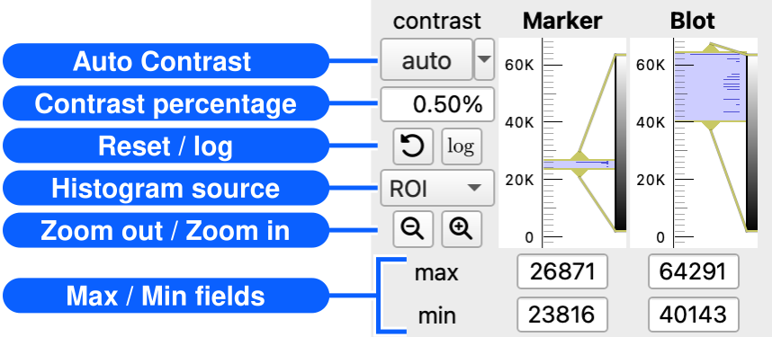
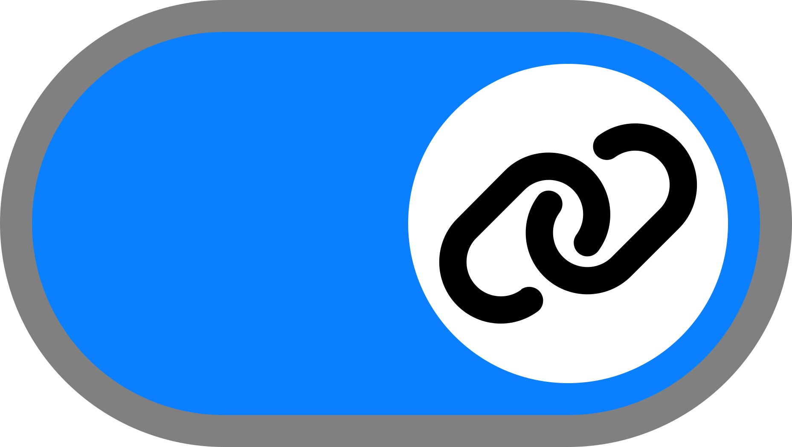
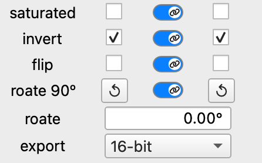

# Adjust marker and blot images

[← How to use MyWB](../user-guide.md)

Correct image orientation, reverse band polarity, and adjust contrast without changing the source image data saved in the MyWB file.

## Before you start

1. Click <picture><source media="(prefers-color-scheme: dark)" srcset="../assets/table-columns-solid_gray20.svg"></picture> **Marker/blot view** in the left sidebar.
2. [Open a blot image](open-images.md).
3. [Open a marker image](open-images.md) if you want to compare or transform both images.

## Contrast

The following adjustments are available:

<table>
  <tr>
    <th colspan="2">Adjustment</th>
    <th>How to</th>
  </tr>
  <tr>
    <td rowspan="2">Automatically adjust the contrast for</td>
    <td>both Marker and Blot images</td>
    <td>Click the <strong>Auto</strong> button in the right control panel.</td>
  </tr>
  <tr>
    <td>only the Marker or Blot image</td>
    <td>Click the small down arrow next to the <strong>Auto</strong> button, then choose <strong>Auto Marker Only</strong> or <strong>Auto Blot Only</strong>.</td>
  </tr>
  <tr>
    <td colspan="2">Adjust the percentile of the contrast</td>
    <td>Change the value in the <strong>Contrast percentage</strong> field, then click <strong>Auto</strong>.</td>
  </tr>
  <tr>
    <td colspan="2">Reset the contrast</td>
    <td>Click the <picture><source media="(prefers-color-scheme: dark)" srcset="../assets/rotate-left-solid_gray20.svg"></picture> <strong>Reset</strong> button. The current contrast adjustments are discarded.</td>
  </tr>
  <tr>
    <td colspan="2">Toggle the histogram count scale between linear and logarithmic</td>
    <td>Click the <picture><source media="(prefers-color-scheme: dark)" srcset="../assets/log_gray20.svg"></picture> <strong>Log</strong> button.</td>
  </tr>
  <tr>
    <td rowspan="2">Change the histogram source to</td>
    <td>the entire image</td>
    <td>Select <strong>All</strong>. The histogram is calculated from the entire image, and the same region is used to calculate the percentile when the <strong>Auto</strong> button is clicked.</td>
  </tr>
  <tr>
    <td>the ROI†</td>
    <td>Select <strong>ROI</strong>. The histogram is calculated only from the ROI, and the ROI is also used to calculate the percentile when the <strong>Auto</strong> button is clicked.</td>
  </tr>
  <tr>
    <td rowspan="2">Adjust the histogram display range</td>
    <td>Zoom out</td>
    <td>Click <picture><source media="(prefers-color-scheme: dark)" srcset="../assets/magnifying-glass-solid_minus_gray20.svg"></picture> <strong>Zoom Out</strong> to restore the full histogram range.</td>
  </tr>
  <tr>
    <td>Zoom in</td>
    <td>Click <picture><source media="(prefers-color-scheme: dark)" srcset="../assets/magnifying-glass-solid_plus_gray20.svg"></picture> <strong>Zoom In</strong> to zoom to the current contrast range.</td>
  </tr>
  <tr>
    <td colspan="2">Manually adjust the contrast range</td>
    <td>Drag the limits on the histogram, or adjust <strong>min</strong> and <strong>max</strong> below the Marker or Blot histogram. The image updates immediately.</td>
  </tr>
</table>

† The **ROI** option for the histogram source is available after you [create an ROI](edit-roi-and-labels.md#roi-management).

## Image controls and export settings

The following controls are available:

| Buttons                                                      | Description                                                  |
| ------------------------------------------------------------ | ------------------------------------------------------------ |
|  | Synchronize image controls between Marker and Blot. When enabled, changes made to one image are automatically applied to the other image. Link buttons are available for **saturated**, **invert**, **flip**, and **rotate 90°**. |
| **saturated**                                                | Highlight pixels outside the current [contrast](#contrast) range. Pixels saturated at the upper limit are shown in magenta, and pixels saturated at the lower limit are shown in cyan. |
| **invert**                                                   | Invert the image intensity so that dark and bright regions are reversed. The [contrast](#contrast) range is automatically adjusted to match the inverted image. |
| **flip**                                                     | Flip the image horizontally.                                 |
| **rotate 90°**†                                   | Rotate the image by the same fixed 90° step each time. Because **flip** mirrors the image, the step appears counterclockwise when **flip** is off and clockwise when **flip** is on. |
| **rotate**                                                   | Fine-tune the image rotation by the selected angle (−180° < angle ≤ 180°). The adjustment is always applied to both **Marker** and **Blot** so that they remain in the same coordinate space. |
| **export**                                                   | Specify the bit depth used when exporting the image.         |

† The **rotate 90°** operation is normally used with  **Link controls** enabled. Because the Marker image size is constrained to match the Blot image, rotating only one image while the controls are unlinked may change the aspect ratio of the Marker image.

## Continue with

- [Select or adjust an ROI](edit-roi-and-labels.md#roi-management)
- [Add marker positions](edit-roi-and-labels.md#add-marker-positions)
- [Preview the figure](design-and-preview-figure.md#preview-of-the-figure)
- [Add notes to a MyWB file](manage-mywb-files.md#add-notes-to-a-mywb-file)
