# Preview, layout, and style of the figure

[← How to use MyWB](../user-guide.md)

Use the live SVG Preview to arrange labels and adjust the figure's appearance.

## Before you start

1. Click <picture><source media="(prefers-color-scheme: dark)" srcset="../assets/table-columns-solid_gray20.svg"></picture> **Marker/blot view** in the left sidebar.
2. [Open a blot image](open-images.md).
3. [Open a marker image](open-images.md) if you want to compare or transform both images.
4. [Adjust marker and blot images](adjust-images.md) if necessary.
5. Add [marker positions](edit-roi-and-labels.md#add-marker-positions) and [sample positions](edit-roi-and-labels.md#add-sample-positions).

## Preview of the figure

Click <picture><source media="(prefers-color-scheme: dark)" srcset="../assets/eye-solid_gray20.svg"></picture> **SVG Preview** in the left sidebar to check the live figure preview. It uses the ROI when one exists and the full blot otherwise.

- Sample-label layout and content can be edited on the **Sample Label** tab.
- Figure appearance can be edited on the **SVG Style** tab under **Global**, **Image**, **Markers**, **Labels**, **Details**, and **Annotation**.

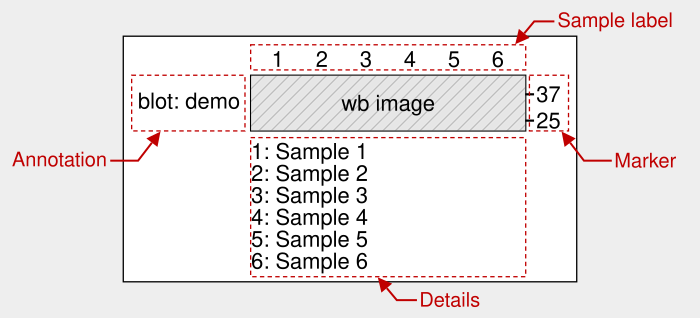

## Edit sample labels

You can select a **Layout** in the **Sample Label** tab when at least one applicable [Sample position](edit-roi-and-labels.md#add-sample-positions) is available. With an ROI, only Sample positions within the ROI's horizontal range are used; without an ROI, all Sample positions are used with the full blot.

<table>
  <tr>
    <td valign="top" width="50%">
      
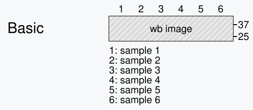

      
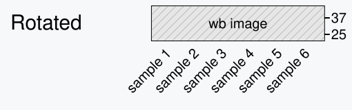

    </td>
    <td valign="top" width="50%">
      
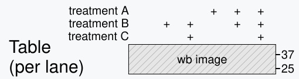

      
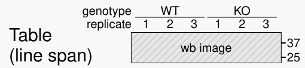

      
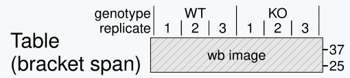

    </td>
  </tr>
</table>

### Edit table layout

When you select a table-based layout, the table editing area appears.

- Use the <picture><source media="(prefers-color-scheme: dark)" srcset="../assets/plus-solid_gray20.svg"></picture> **Add**, <picture><source media="(prefers-color-scheme: dark)" srcset="../assets/arrow-up-solid_gray20.svg"></picture> **Up**, <picture><source media="(prefers-color-scheme: dark)" srcset="../assets/arrow-down-solid_gray20.svg"></picture> **Down**, and <picture><source media="(prefers-color-scheme: dark)" srcset="../assets/trash-can-regular_gray20.svg"></picture> **Trash** buttons to add, move, or delete rows.
- Use the <picture><source media="(prefers-color-scheme: dark)" srcset="../assets/align-right-solid_gray20.svg"></picture> **Row header alignment** button to cycle row headers through right, center, and left alignment. The icon indicates the current alignment.
- For the **Table (per lane)** layout, the text entered in each table cell is used directly as the label.
- For the **Table (line span)** and **Table (bracket span)** layouts, adjacent cells containing the same text are merged and displayed as a single label.
- Move the **Separator** up or down to place table rows above and below the blot.
- Click the <picture><source media="(prefers-color-scheme: dark)" srcset="../assets/gear-solid_gray20.svg"></picture> **Settings** button to configure row-specific settings.
- Additional style settings are available as shown below.

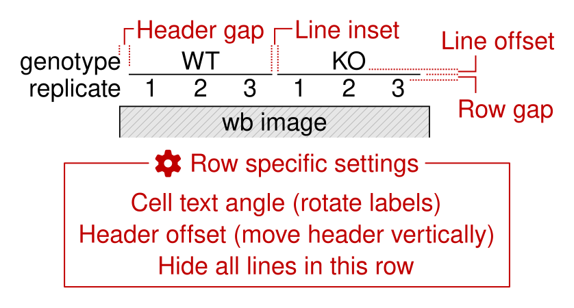

Below are several examples of table layouts.

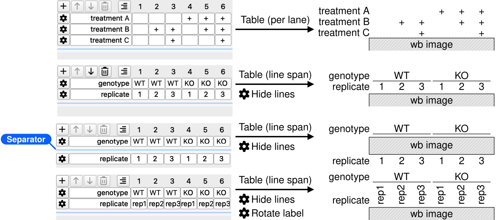

### Edit rotated layout

- Enter a value in **Angle** to set the label rotation angle (−90° ≤ Angle ≤ 90°).
- Select **Anchor** to set the reference point for label rotation. The **automatic** option works well in most cases.
- By default, the rotated label uses the same text as **Sample Details**.
- To use a label different from **Sample Details**, enter custom text in the **Rotated label** field.
- Click the <picture><source media="(prefers-color-scheme: dark)" srcset="../assets/link-solid_gray20.svg"></picture> **Link** button to restore the label from **Sample Details**.

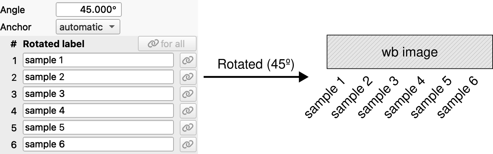

### Settings by layout

The table below shows which settings are available for each layout.

| Setting       | Basic         | Rotated       | Table (per lane) | Table (line span) | Table (bracket span) |
| ------------- | ------------- | ------------- | --------------------- | ---------------------- | ------------------------- |
| Position      | ✅️† | ✅️† | ✅️‡         | ✅️‡          | ✅️‡             |
| Angle         | ❌️             | ✅️             | ✅️§         | ✅️§          | ✅️§             |
| Anchor        | ❌️             | ✅️             | ❌️                     | ❌️                      | ❌️                         |
| Row gap       | ❌️             | ❌️             | ✅️¶         | ✅️¶          | ✅️¶             |
| Header gap    | ❌️             | ❌️             | ✅️                     | ✅️                      | ✅️                         |
| Header side   | ❌️             | ❌️             | ✅️                     | ✅️                      | ✅️                         |
| Header offset | ❌️             | ❌️             | ✅️§         | ✅️§          | ✅️§             |
| Line width    | ❌️             | ❌️             | ❌️                     | ✅️                      | ✅️                         |
| Line inset    | ❌️             | ❌️             | ❌️                     | ✅️                      | ✅️                         |
| Line offset   | ❌️             | ❌️             | ❌️                     | ✅️                      | ❌️                         |
| Hide lines    | ❌️             | ❌️             | ❌️                     | ✅️§          | ✅️§             |
| Text offset   | ❌️             | ❌️             | ❌️                     | ❌️                      | ✅️                         |

† With **Position** set to **Auto**, sample labels are placed above or below the blot based on the sample positions within the selected figure area. 
‡ With **Position** set to **Auto**, table rows can be placed both above and below the blot. See [Edit table layout](#edit-table-layout) for details. 
§ These settings appear when you click the gear icon for a row. 
¶ This setting is unavailable when there is only one row, or when two rows are split between the top and bottom of the blot.

## Edit SVG style

The following settings can be edited:

- **Global:** margins and font family
- **Image†:** pixel width, pixel height, scale (%), and border width
- **Markers‡:** position, gap, font size, baseline offset, tick width, and tick length
- **Labels§:** position, font size, and gap
- **Details:** visibility, font size, and gap
- **Annotation¶:** text, position, font size, gap, and text alignment

† **Pixel width**, **Pixel height**, and **Scale (%)** are linked to one another. 
‡ **Position** is linked to **Annotation > Position** and uses the opposite side. 
§ **Position** is linked to **Sample Label > Position**. 
¶ **Position** is linked to **Markers > Position** and uses the opposite side.

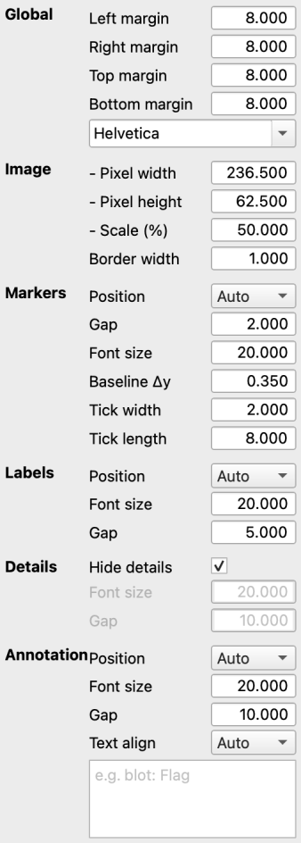

On the **SVG Style** tab, use the **...** menu to select **Load System Default**, **Toggle Previous Style**, or **Save Current Style As...**.

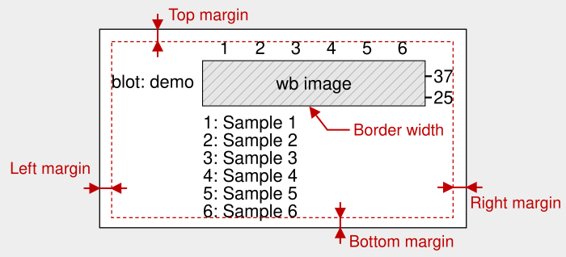

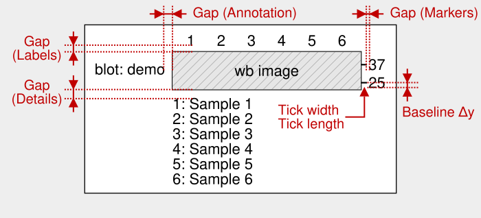

## Continue with

- [Save the editable MyWB file](manage-mywb-files.md#common-mywb-file-operations)
- [Copy the figure to PowerPoint](powerpoint-workflow.md#powerpoint-workflow)
- [Adjust marker and blot images](adjust-images.md)
