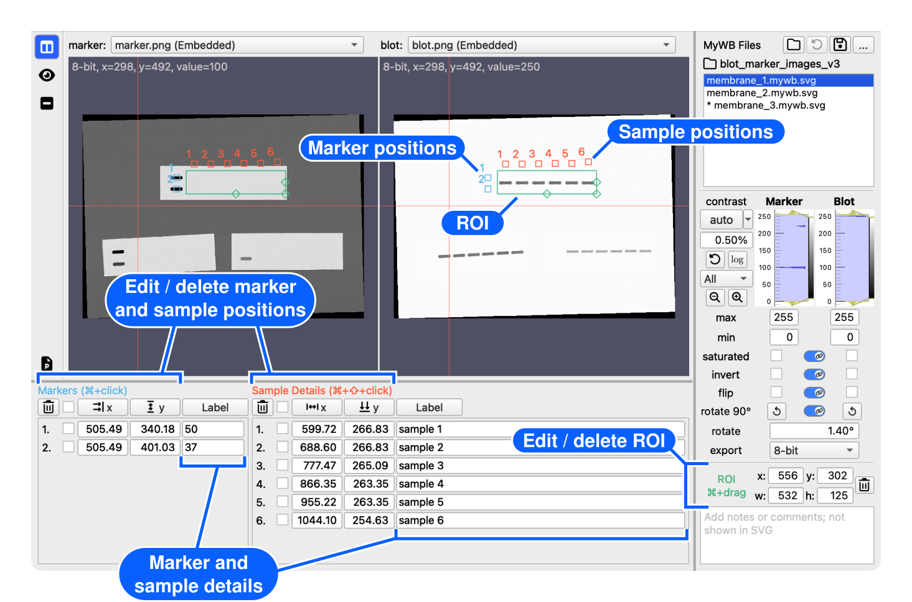

# Edit the ROI and labels

[← How to use MyWB](../user-guide.md)

Select the part of the image to use, then place molecular-weight marker and sample labels beside the bands.

## Before you start

1. Click <picture><source media="(prefers-color-scheme: dark)" srcset="../assets/table-columns-solid_gray20.svg"></picture> **Marker/blot view** in the left sidebar.
2. [Open a blot image](open-images.md).
3. [Open a marker image](open-images.md) if you want to compare or transform both images.
4. [Adjust marker and blot images](adjust-images.md) if necessary.

## Overview

## ROI management

Hold  (macOS) or  (Windows) and drag in either image pane. A green rectangle appears in both image panes. After creating the ROI, you can:

- Drag inside the green rectangle to move it.
- Drag a green handle to resize it.
- Hold <kbd>Shift</kbd> while moving it to constrain movement horizontally or vertically.
- Enter exact values in the `x`, `y`, `w`, and `h` fields in the right panel.
- With an `x`, `y`, `w`, or `h` field focused, press <kbd>↑</kbd> or <kbd>↓</kbd> to increase or decrease its value.
- To delete the ROI, click the <picture><source media="(prefers-color-scheme: dark)" srcset="../assets/trash-can-regular_gray20.svg"></picture> **Trash** button beside the ROI coordinates.

The ROI cannot extend outside the blot image. An ROI is required to [quantify bands](quantify-bands.md) or [export a cropped image](export-cropped-image.md). It is optional for SVG Preview, saving, and copying to PowerPoint; without one, the full blot is used.

## Add marker and sample positions

Hold the shortcut for the desired type and click in either image pane to add a position. A point appears in both panes. Repeat for each reference or lane you want to label.

| Type   | Shortcut                                                     | Position behavior                                            |
| ------ | ------------------------------------------------------------ | ------------------------------------------------------------ |
| Marker |  | The vertical (y) position determines the molecular-weight level. |
| Sample |  | The horizontal (x) position determines the lane position.    |

When you add a Marker or Sample position, a new row appears in the corresponding **Markers** or **Sample Details** panel at the bottom of the window. Enter text in the corresponding field.

- For a Marker position, enter a molecular-weight value.
- For a Sample position, enter sample details. These are separate from the [sample label](design-and-preview-figure.md#edit-sample-labels) displayed in the figure. You can show or hide the details using the corresponding option. See [Hide details](design-and-preview-figure.md#edit-svg-style) for more information.

To edit multiple labels at once, click the **Label** button above the table and enter one value per line. You can also use the [Marker Auto Fill](settings.md#auto-fill-presets) or [Sample Prefix Auto Fill](settings.md#auto-fill-presets) presets to reuse frequently used labels.

## Modify marker or sample positions

You can adjust positions using the following methods:

- Drag a point directly.
  - Hold <kbd>Shift</kbd> while dragging to constrain movement horizontally or vertically.
  - To move multiple positions together, select their row checkboxes, then drag one of the selected points. Only selected positions of the same type move together: Marker positions and Sample positions remain independent. Dragging an unselected point moves only that point.
- Enter exact values in the `x` and `y` fields in the position panel at the bottom of the window.
- With an `x` or `y` field focused, press <kbd>↑</kbd> or <kbd>↓</kbd> to increase or decrease its value.
- Select the checkboxes for the rows you want to modify, then click the **x** or **y** button to apply the desired alignment or distribution.

  - **Marker x button — Align X Coordinates:** Places markers on a single vertical line.
  - **Marker y button — Distribute Y Coordinates:** Evenly distributes three or more markers from top to bottom.
  - **Sample x button — Distribute X Coordinates:** Evenly distributes three or more Sample positions from left to right.
  - **Sample y button — Align Y Coordinates:** Places Sample positions on a single horizontal line.

  **Align** uses the largest selected coordinate; **Distribute** assigns evenly spaced coordinates from the minimum to the maximum in the current table row order.

Positions cannot extend outside the blot image.

## Delete marker or sample positions

1. Click the checkbox for every row you want to remove.
2. Click the <picture><source media="(prefers-color-scheme: dark)" srcset="../assets/trash-can-regular_gray20.svg"></picture> **Trash** button above the table.

## Continue with

- [Choose a sample-label layout](design-and-preview-figure.md#edit-sample-labels)
- [Preview the figure](design-and-preview-figure.md#preview-of-the-figure)
- [Quantify bands](quantify-bands.md) 
