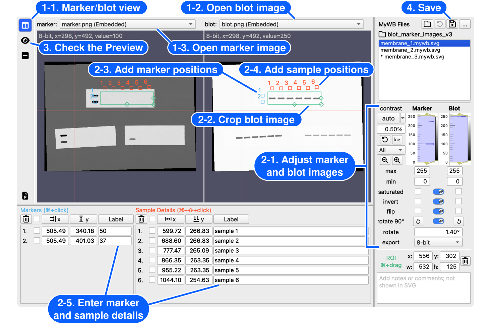

# Create a figure from a blot

[← How to use MyWB](../user-guide.md)

Turn a source blot into an editable, presentation-ready figure.

## Before you start

A blot image is required. A matching marker image is optional.

## Steps

1. Open images

    - Open <picture><source media="(prefers-color-scheme: dark)" srcset="../assets/table-columns-solid_gray20.svg"></picture> **Marker/blot view** in the left sidebar.
    - Click **[Open blot image...](open-images.md)**, then choose the source image.
    - If you have a matching molecular-weight marker image, click **[Open marker image...](open-images.md)**, then choose that image.
2. Edit the ROI and labels
    - [Adjust marker and blot images](adjust-images.md) in the right control panel.
    - [Select the ROI](edit-roi-and-labels.md#roi-management) in the blot image by holding  (macOS) or  (Windows), then dragging across the area you want to use.
    - Add [molecular-weight marker positions](edit-roi-and-labels.md#add-marker-positions) with .
    - Add [sample positions](edit-roi-and-labels.md#add-sample-positions) with .
    - Enter molecular-weight values and sample details in the corresponding rows below the images.
3. Check the preview
    - Open <picture><source media="(prefers-color-scheme: dark)" srcset="../assets/eye-solid_gray20.svg"></picture> **SVG Preview** in the left sidebar.
    - Adjust the [sample-label layout](design-and-preview-figure.md#edit-sample-labels) or [figure style](design-and-preview-figure.md#edit-svg-style) in the right panel.
4. Save

    - Click the <picture><source media="(prefers-color-scheme: dark)" srcset="../assets/floppy-disk-regular_gray20.svg"></picture> **Save** button in the **MyWB Files** panel to keep an [editable `.mywb.svg` file](manage-mywb-files.md#common-mywb-file-operations).

## Common adjustments

- Is an image sideways or mirrored? [Rotate, flip, or invert it](adjust-images.md#image-controls-and-export-settings).
- Are bands difficult to see? [Adjust contrast](adjust-images.md#contrast).
- Need a more precise figure boundary? [Move or resize the ROI](edit-roi-and-labels.md#roi-management).
- Need table-style or rotated sample labels? [Choose a sample-label layout](design-and-preview-figure.md#edit-sample-labels).
- Need different fonts, spacing, or image size? [Adjust the figure style](design-and-preview-figure.md#edit-svg-style).

## Continue with

- [Use the figure in PowerPoint](powerpoint-workflow.md)
- [Quantify bands in the ROI](quantify-bands.md) 
- [Export the ROI as a cropped image](export-cropped-image.md)
