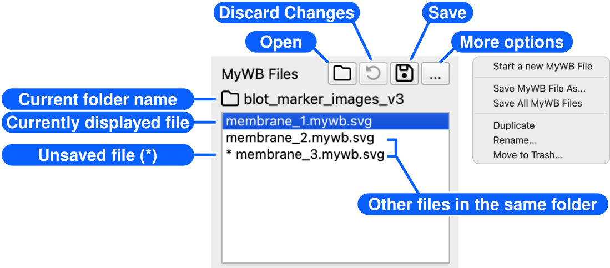
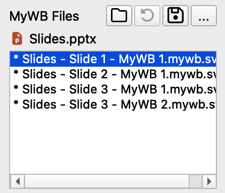

# Manage MyWB files

[← How to use MyWB](../user-guide.md)

Use the **MyWB Files** panel to create, open, save, and organize editable `.mywb.svg` files. You can also switch between files in a folder or between recoverable figures imported from a PowerPoint presentation.

## Common MyWB file operations

| Operation                  | Toolbar / button                                             | File menu                                           | Keyboard shortcut                                            | Other                                                        |
| -------------------------- | ------------------------------------------------------------ | --------------------------------------------------- | ------------------------------------------------------------ | ------------------------------------------------------------ |
| **Start a new MyWB File**  | **…** menu                                                   | **File > New MyWB File**                            | <kbd>Command+N</kbd> (macOS) <kbd>Ctrl+N</kbd> (Windows) | —                                                            |
| **Open** | <picture><source media="(prefers-color-scheme: dark)" srcset="../assets/folder-regular_gray20.svg"></picture> **Open** | **File > Open MyWB File** **File > Open Recent** | <kbd>Command+O</kbd> (macOS) <kbd>Ctrl+O</kbd> (Windows)  | Drag a MyWB file onto the MyWB window                        |
| **Import from PowerPoint**  | —                                                            | **File > Import MyWB from PowerPoint File...**      | <kbd>Command+I</kbd> (macOS) <kbd>Ctrl+I</kbd> (Windows) | Drag a PowerPoint file onto the MyWB window                  |
| **Save** | <picture><source media="(prefers-color-scheme: dark)" srcset="../assets/floppy-disk-regular_gray20.svg"></picture> **Save** | **File > Save MyWB File**                           | <kbd>Command+S</kbd> (macOS) <kbd>Ctrl+S</kbd> (Windows)  | —                                                            |
| **Save As**                | **…** menu                                                   | **File > Save MyWB File As...**                     | <kbd>Command+Shift+S</kbd> (macOS) <kbd>Ctrl+Shift+S</kbd> (Windows) | —                                                            |
| **Save All**               | **…** menu                                                   | **File > Save All MyWB Files**                      | —                                                            | —                                                            |
| **Discard Changes**        | <picture><source media="(prefers-color-scheme: dark)" srcset="../assets/rotate-left-solid_gray20.svg"></picture> **Discard Changes** | **File > Discard Selected MyWB File Changes...**    | —                                                            | —                                                            |
| **Duplicate**              | **…** menu                                                   | **File > Duplicate MyWB File**                      | —                                                            | —                                                            |
| **Rename**                 | **…** menu                                                   | **File > Rename MyWB File...**                      | —                                                            | In the **MyWB Files** panel, select a file and press <kbd>Enter</kbd> |
| **Move to Trash**          | **…** menu                                                   | **File > Move MyWB File to Trash...**               | —                                                            | —                                                            |

## Use the MyWB Files panel

### Files in a folder

When you open or save a `.mywb.svg` file, the **MyWB Files** panel shows the current file and any other `.mywb.svg` files in the same folder.

- The current folder name appears beside the <picture><source media="(prefers-color-scheme: dark)" srcset="../assets/folder-regular_gray20.svg"></picture> folder icon above the list.
- The highlighted row is the document currently displayed in MyWB.
- An asterisk (`*`) before a name indicates changes that have not yet been saved.
- Select a file in the list to display it.

The **MyWB Files** panel is especially useful when multiple membranes are captured in a single source image. Save a separate `.mywb.svg` file for each membrane in the same folder, and you can switch between their saved ROIs, labels, image adjustments, and figure layouts by selecting a file in the panel.

### Figures imported from PowerPoint

When you import a `.pptx` file, the panel shows the recoverable MyWB figures in it.

- The presentation file name appears beside the <picture><source media="(prefers-color-scheme: dark)" srcset="../assets/copy_to_powerpoint_ppt-color.svg"></picture> PowerPoint icon above the list.
- Imported figures remain unsaved until you save them as external `.mywb.svg` files. Saving does not modify the PowerPoint file.
- For details, see [Use MyWB with PowerPoint](powerpoint-workflow.md#powerpoint-workflow).

## Add notes to a MyWB file

Use the note field at the bottom of the right control panel to save free-form notes, such as sample provenance or a lab notebook number, with the current `.mywb.svg` file. The notes are restored when the file is reopened but do not appear in the figure. To display text in the figure, use an [annotation](design-and-preview-figure.md#edit-svg-style) instead.

## Continue with

- [Preview and adjust the figure](design-and-preview-figure.md)
- [Use the figure in PowerPoint](powerpoint-workflow.md)
- [Quantify bands](quantify-bands.md) 
