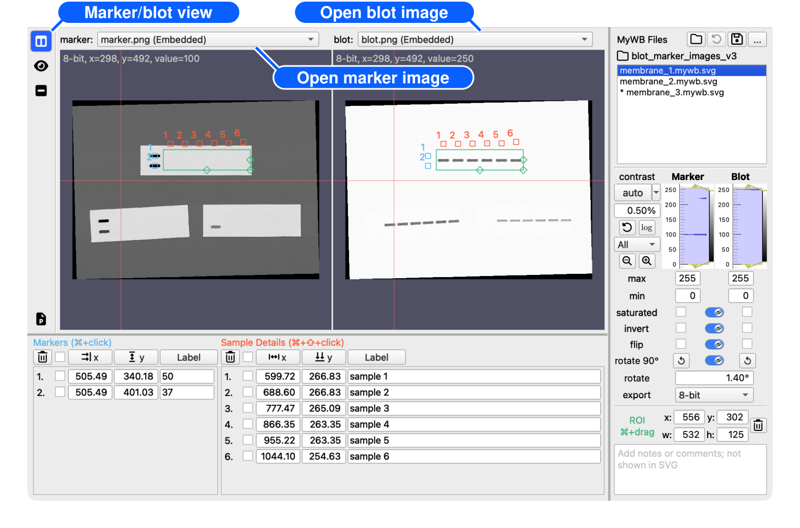
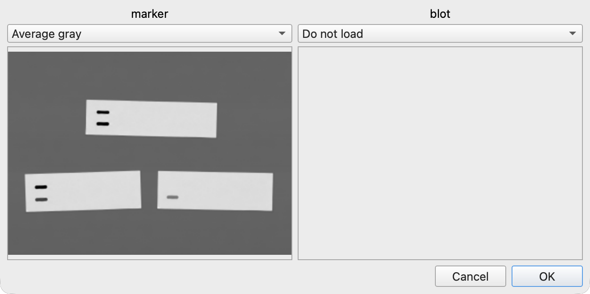

# Open marker and blot images

[← How to use MyWB](../user-guide.md)

Open a blot image to begin a figure or quantification. A matching molecular-weight marker image is optional.

## Before you start

Click <picture><source media="(prefers-color-scheme: dark)" srcset="../assets/table-columns-solid_gray20.svg"></picture> **Marker/blot view** in the left sidebar.

## Open a marker or blot image

You can open each image in any of the following ways:

| Method | Marker image | Blot image |
| --- | --- | --- |
| Click | **Open marker image...** from the marker image selector at the top left of the window | **Open blot image...** from the blot image selector at the top right of the window |
| Menu | **File > Open Marker Image** | **File > Open Blot Image** |
| Keyboard shortcut† | <kbd>Command+Option+O</kbd> (macOS) or <kbd>Ctrl+Alt+O</kbd> (Windows) | <kbd>Command+Shift+O</kbd> (macOS) or <kbd>Ctrl+Shift+O</kbd> (Windows) |
| Drag and drop | Drag an image into the Marker pane | Drag an image into the Blot pane |

† <kbd>Command+O</kbd> (macOS) or <kbd>Ctrl+O</kbd> (Windows) is used to [open MyWB files](manage-mywb-files.md#common-mywb-file-operations).

> [!TIP]
> After you open an image, its selector lists other supported images in the same folder. Select a filename to switch images without reopening the file dialog. To close an image, select **Close image** from its image selector.

MyWB fits the marker image to the blot coordinate space so both panes can share an ROI and label positions.

Use the mouse wheel or trackpad to zoom, and drag to pan. Both actions are synchronized between the panes and do not change the exported image. To reset both panes, right-click either image and select **Reset View**.

## Select an RGB channel

When you open an RGB or RGBA image, **Select RGB channels** appears. Choose a value for each image role:

- **Average gray**
- **Red**
- **Green**
- **Blue**
- **Do not load**

Choose the channel for each image role before clicking **OK**. You can load two channels from one image—for example, Green as the marker and Red as the blot. After loading, use the channel field beside the filename to switch channels.

## Supported images

MyWB accepts Bio-Rad Image Lab `.scn` files, as well as `.tif`, `.tiff`, `.png`, `.jpg`, and `.jpeg` files. Decoded image data must consist of 8-bit or 16-bit unsigned integers. JPEG is 8-bit; compatible PNG and TIFF files can be 16-bit. Floating-point, signed-integer, and unsupported 16-bit layouts are rejected instead of being reduced in precision.

## Continue with

- [Select an ROI](edit-roi-and-labels.md#roi-management)
- [Adjust marker and blot images](adjust-images.md)
