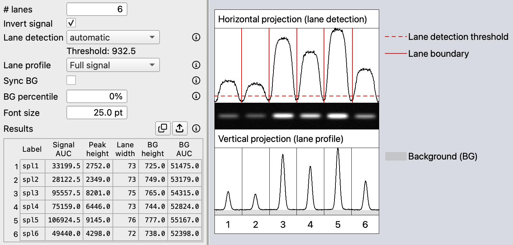
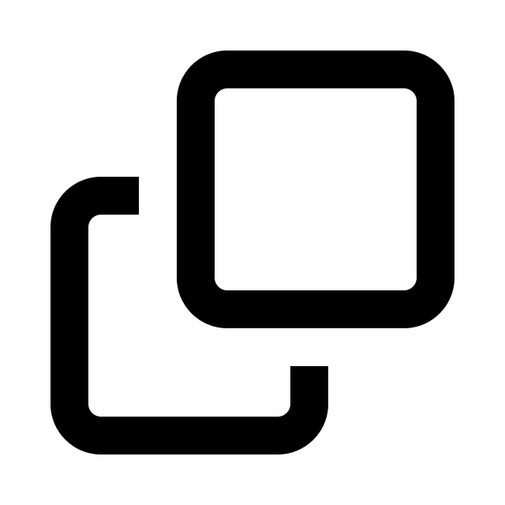
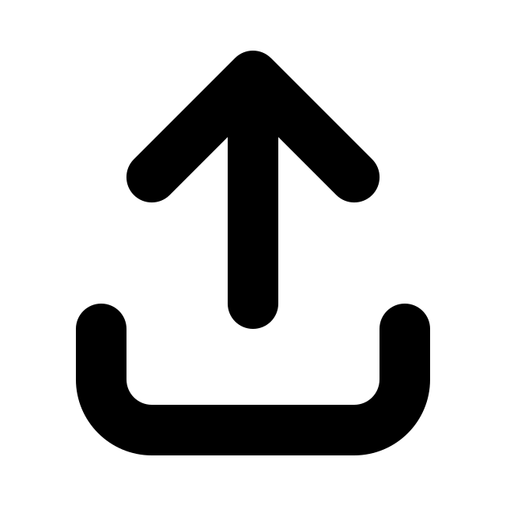

# Quantify bands 

[← How to use MyWB](../user-guide.md)

Detect lanes, inspect their profiles, and export measurements from an ROI. Quantification is performed independently of the image contrast and inversion settings in **Marker/blot view**. Based on the ROI defined in **Marker/blot view**, the core quantification workflow consists of the following three steps.

1. Lane detection

    The ROI image is summed vertically at each X position to generate a left-to-right lane signal profile called the **Horizontal projection**. Lane boundaries are set from this profile.

2. Densitogram generation

    The ROI image is split into lane rectangles using the lane boundaries defined in the **Horizontal projection**. Within each lane, pixel intensity is summed across the lane width at each Y position to generate a lane profile called the **Vertical projection**. The left side of each lane profile corresponds to the top of the image, and the right side corresponds to the bottom.

3. Background removal

    Background is subtracted from each generated densitogram, and the area under the curve (AUC) is calculated.

> [!TIP]
> To improve accuracy, rotate the image in **Marker/blot view** so that the bands are horizontal before opening **Quantification**.

## Before you start

See **[Create a figure from a blot](from-blot-to-figure.md)** for the complete figure workflow. Only the following parts of that workflow are required for Quantification:

- [Open a blot image](open-images.md).
- [Create an ROI](edit-roi-and-labels.md#roi-management).

All other parts of the workflow—including opening a marker image, adding marker or sample positions, previewing or styling the figure, and saving a `.mywb.svg` file—are optional for Quantification.

## Steps

### Open Quantification

1. Click <picture><source media="(prefers-color-scheme: dark)" srcset="../assets/square-minus-regular_WB_gray20.svg"></picture> **Quantification** in the left sidebar.
2. Complete the Premium Access check if MyWB asks for it.

### Set up lane detection

1. Enter the number of lanes in **# lanes**. The default value is the number of sample positions within the ROI's horizontal range, or one lane when there are none.
2. Enable **Invert signal** when the bands appear as low values (i.e., black) instead of high values (i.e., white). Quantification requires the signal to be bright and the background to be dark. This checkbox is independent of the **invert** checkboxes in the control panel on the right, which affect only how the images appear in **Marker/blot view**.
3. Inspect the red vertical lane boundaries in the **Horizontal projection** over the ROI image. The following lane detection modes are available:
    - **automatic:** You do not have to do anything when the red vertical lane boundaries match the visible lanes. If they do not, use another mode.
    - **semi-automatic:** The red horizontal dashed line in the **Horizontal projection** becomes movable. As you move the line up or down, the red vertical lane boundaries are updated accordingly.

        If no threshold produces the number of lane regions specified in **# lanes**, **semi-automatic** is unavailable; MyWB either keeps the previous mode or returns to **automatic**.

        > [!TIP]
        >
        > For better lane detection, position the red horizontal dashed line at a height where it intersects all lane peaks.

    - **full-manual:** All red vertical lane boundaries can be adjusted manually. The red horizontal dashed line is hidden in this mode.

4. A lane profile (densitogram) is automatically generated for each lane and shown in the **Vertical projection**.

### Adjust background subtraction

In the **Vertical projection**, the gray area indicates the portion identified as background. When the background level is low, the gray area may be difficult to see.

1. Use **Lane profile** mode to switch between **Full signal** and **BG removed**. This changes the graph appearance only; it does not change the result values.

2. Set **Sync BG**. When enabled, each summed lane profile is normalized by its lane width, and the normalized profiles are pooled to calculate one shared background level per pixel of lane width.

    > [!NOTE]
    > For each lane, this shared background level is multiplied by that lane's width before being subtracted from its summed profile. Consequently, lanes with different widths may have different **BG height** values.

    When disabled, the background level is calculated separately for each lane. This setting has no effect when only one lane is used.

3. Change **BG percentile** to choose the background level from each lane profile. Increasing the percentile generally raises the estimated background level and subtracts more from the profile. After background subtraction, negative values are clipped to zero. With Sync BG enabled, the lane profiles are normalized by lane width and pooled before the percentile is calculated.

    - **0%:** Uses the minimum profile value.
    - **25%:** Uses the first quartile (Q1); approximately 25% of the profile values are at or below this value.
    - **50%:** Uses the median profile value.

    > [!NOTE]
    >
    > At 100%, the maximum profile value is used as the background level. All background-subtracted values are therefore clipped to 0, so **Signal AUC** is 0.

### Review and export the results

1. Check the results table. MyWB recalculates automatically when you change settings; there is no separate "Run" button.
2. Click the <picture><source media="(prefers-color-scheme: dark)" srcset="../assets/clone-regular_gray20.svg"></picture> **Copy Results** button to copy the table to the clipboard, or the <picture><source media="(prefers-color-scheme: dark)" srcset="../assets/arrow-up-from-bracket-solid_gray20.svg"></picture> **Export Results** button to save the results and graph.
    - **Output location:** MyWB creates a new `_quantification` folder, usually beside the blot image. The completion message shows the exact location.
    - **Files:** MyWB saves a tab-separated values (TSV) result table with a `.csv` filename extension, a single SVG graph containing the **Horizontal projection** and the **Vertical projection**, and a `.mywb.svg` snapshot.
    - The **Label** column of the table shows `unknown` when the number of sample positions within the ROI's horizontal range does not match **# lanes**. To change sample positions, return to **Marker/blot view** and add, remove, or move [sample positions](edit-roi-and-labels.md#add-sample-positions).

## Continue with

- [Save the MyWB file](manage-mywb-files.md#common-mywb-file-operations)
- [Return to Marker/blot view](edit-roi-and-labels.md)
